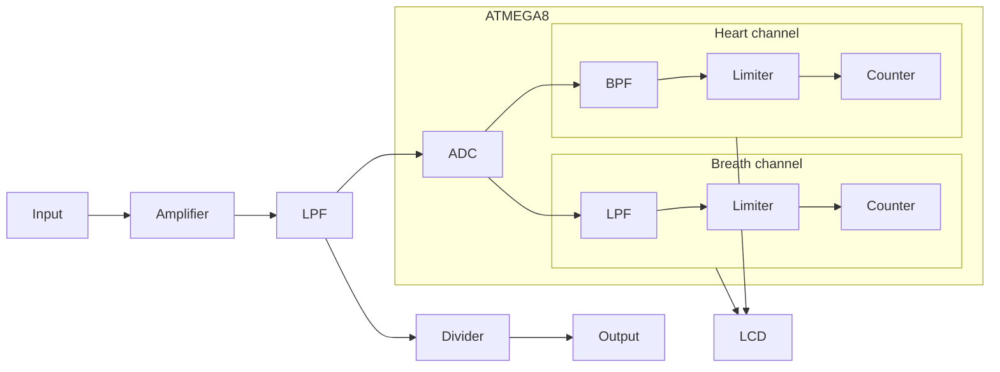
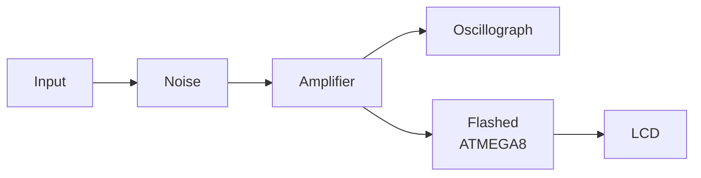

# Heart & Breath processing device

I had to design a device used for real-time processing of signals of a biolocation system that receives breath and heartbeat parameters using interferometry method and a scheme containing a hybrid tee (magic tee). One of the usages of this biolocation system is to discover people trapped under debris after e.g. an earthquake.

## Input Description

A complex signal that a human chest would generate: it contains at least two waveforms (one for the lungs oscillations, one for the heart oscillations) and some amount of the medium noise.

1. Wavelength: 3cm
1. Microwave generator power: ≤ 10µW
1. Range: ≤ 5m
1. Breath rate: 15..50 min-1
1. Heart rate: 40..150 min-1

## Limitations

The generator power must be kept as low as possible, because we don't want to even further harm a person who's life feels like a mess already.

I couldn't use any type of a standalone computer system due to economic reasons (yes, the diploma contains all that stuff as well), so I decided to go with something smaller and much cheaper, and thought of a microcontroller: you write some code once, you flash the MC, you give it some power, and it works – very convenient. I had to learn the ways of the ~~force~~ microcontrollers, the CodeVisionAVR program and a bit of C language.

Also, there's never any funding, so all the things I'd have to test – I'd have to simulate them somehow.

## Design Process

First, I had to design the horn antenna for the tee to assume for the input signals and the generator power limitation.

Second, I had to come up with an appropriate amplifier so that the useful signal is not lost in the noises. I "used" AD8628ARTZ by Analog Devices. No one of course could provide me with a real amplifier, so I just simulated its params in Proteus.

Next, I had to tell the heartbeat from the breath, and to do that I used the spectral analysis and designed two digital filters: a low-pass filter for breath and a band-pass filter for heartbeat. I calculated the coefficients, used Matlab for the prototypes, and it all worked quite well.

## Device Structure

1. An amplifier, to raise the amplitude of the input signal
1. A low-pass filter (LPF), to get rid of the useless noise
1. A microcontroller "scheme", to process the signal
  1. An ADC to convert a constant signal to bits
  1. A breath "circuit"
    1. A low-pass filter
    1. A limiter
    1. A counter
  1. A heart "circuit"
    1. A band-pass filter
    1. A limiter
    1. A counter
1. Some LCD, to indicate the processed signals

## Choosing an MC

For the MC I used ATMega8 by ATMEL. It's not like I was choosing from a lot of options, it just had all the things I needed: ADC, counters and a comparator.

Even though I didn't optimize the code, or used the internal stack or EEPROM (I was 23 back then, cut me some slack!), I still think it all turned out very well, as the flashed code has taken 96.5% of the MC storage memory.

## Simulation

I used Proteus to:
1. Simulate the input signal, using two different sine-signals summed up in a summator
2. Add some possible medium noise, using a high-frequency signal in another summator
3. Recreate the amplifier scheme, using active components (`R`, `C`)
4. Monitor the amplified noisy signal that becomes the input signal of the MC
5. Flash the MC with the `.hex` file I got from the CodeVisionAVR build
6. Show the MC output on an LCD

#### Amplifier Simulation Scheme

#### LCD Output

## Motherboard Design

I also had to design the motherboard to house the device.

## What I Feel

Even though I didn't have the result in physical world (which would be very nice, of course), by the time that I finished this project and defended the diploma, I felt very satisfied about how I was able to dive into lots of new fields of knowledge, to make myself "do it", and how [everything felt into its right place](https://youtu.be/T0uYhclh9f8?t=2032).
I still feel very proud of myself for all that work, and I don't care that the code is very sloppy.
